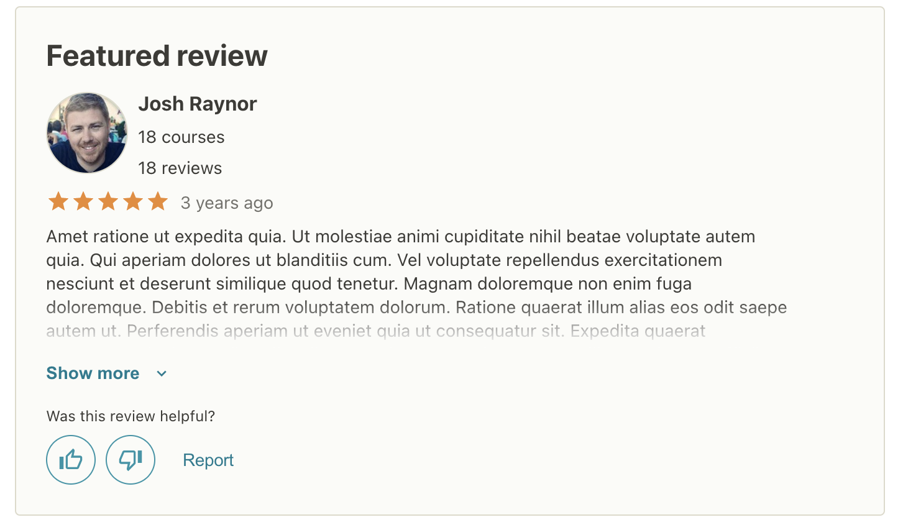
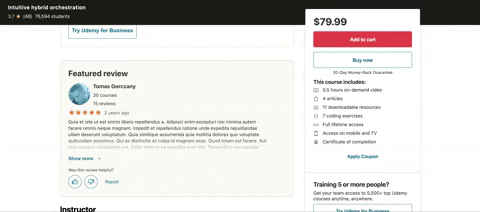
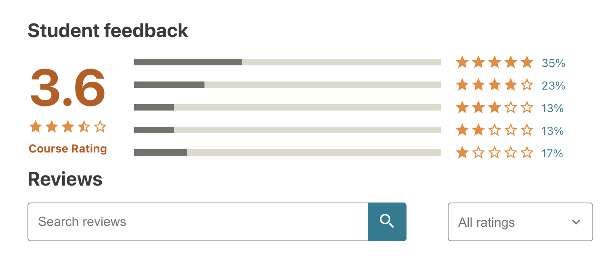
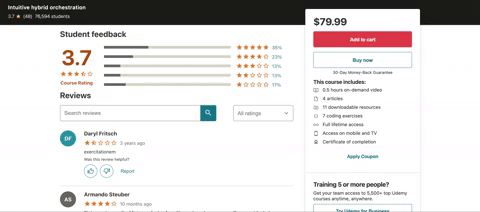
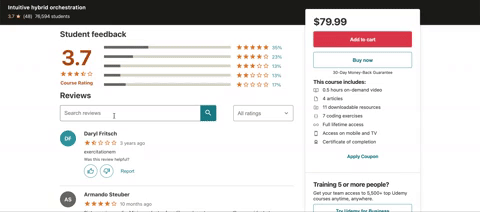
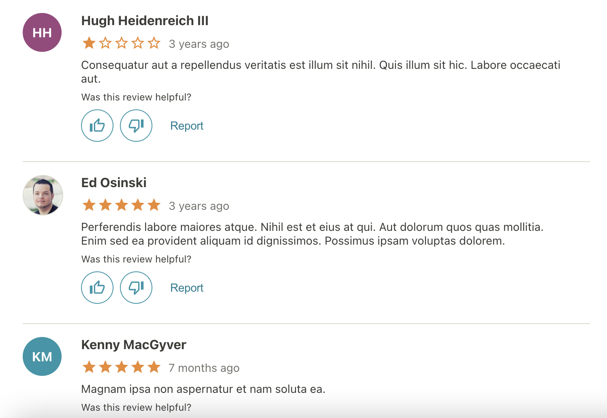
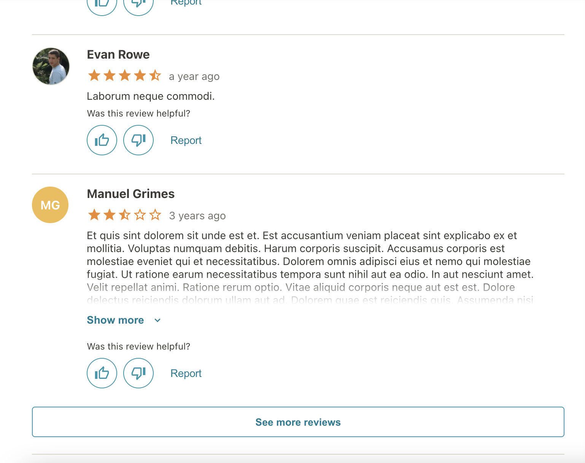

# Project Name
Reviews for Udemy Clone (Front End Capstone project by Hack Reactor RPT27 team Charlotte Badger https://github.com/Charlotte-Badger)

## Related Projects
- Course Content (Kyle Johnson)
https://github.com/Charlotte-Badger/Course-Content
- Overview (Eric Knechtges)
https://github.com/Charlotte-Badger/Overview
- Sidebar (Jason Carini)
https://github.com/Charlotte-Badger/Sidebar
- Author (Eric Knechtges)
https://github.com/Charlotte-Badger/Author
- Proxy (Jason Carini, with some help from KJ, EK, and FR)
https://github.com/Charlotte-Badger/udemy-proxy-carinij


## Table of Contents
1. [Requirements](#requirements)
2. [Installation](#installation)


## Requirements
- Node 6.13.0

## Installation
### Installing dependencies
From within the Reviews directory:
```sh
npm install
```
### Creating the bundle file
From within the Reviews directory:
```sh
npm run build (development mode)
npm run prod (production mode)
```
### Populating the database
From within the Reviews directory:
```sh
npm run seedMongo
```
### Starting the server
From within the Reviews directory:
```sh
npm start
```

### Featured Review



### Feedback




### Reviews



